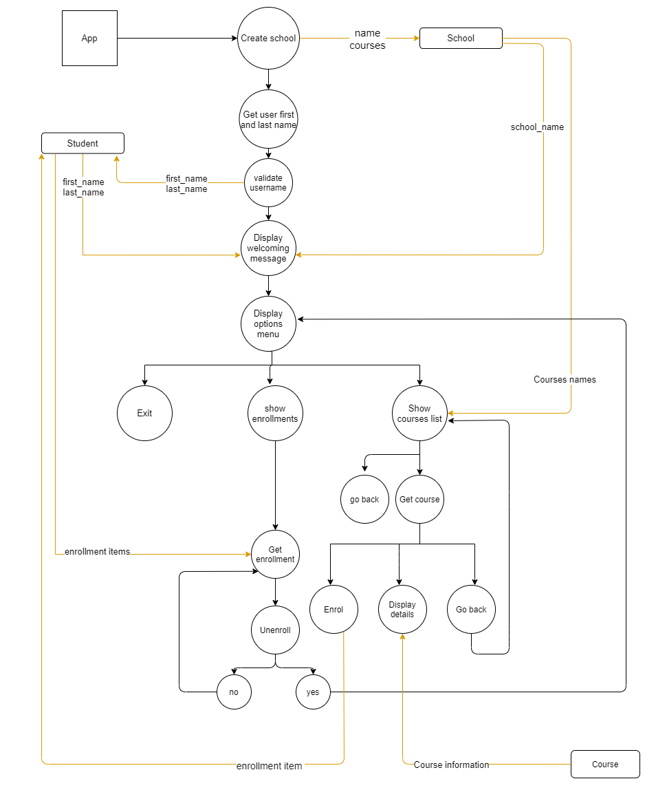

**GitHub Repository Link:**https://github.com/robaElshazly/TerminalApp

**Software Development Plan**

- **What the Application will do:**

  This is an online school app that gives users a variety of online courses options to enroll in.
- **The problem it will Solve:**

  The app will help keep track of the courses users previously enrolled in.
  It will also show them information about evey course to help them make a decision.
- **Target Audience:**
Any one interested in online learning.
- **How To Use the App:**
This app can be used by running run.sh file. After that, clear instructions will prompt the user on the next steps of usage. 

**Features of the App**

1- **Welcoming Message:** The app will show a welcoming message in the start with the name of the user. The name of the user can be entered in by command line arguments or answering the question in the beginning.

2- **Enrolling in a Course:** The app will enable the user to enroll in a course and add the course to the list of enrolled courses.

3- **Unenrolling in a Course:** The app will also enable the user to unenroll in a course.

4- **Display information of a course:** Also the user will be able to display the information of each course like duration, coast, price and syllabus.


**How the user will find out how to use the app**
There is a help document found in the root folder.
Also, after the welcoming message the user will be givin a message that says "If you want to know how to use the app please read the help file in doc folder"

**How user will interact and use each feature**

1- **To run the program and see the welcoming message with your name:**

To run the program ,You can either :
- Run the below command in terminal followed by your first and last name.
```
run.sh <your first name> <your last name>
```
- Or you can just run the file run.sh and a question asking you about your first and last name will show up. you then should type in your name.

*Errors expected and how they are handled*

Notice that if you skip and not type anything. you will receive an error message saying "please type a valid name".

If only one name is entered or more than two names are entered, the program will run as no arguments are entered and will aske about first and last name. 


2- **To Enrol in a Course:**

After running the app like mentioned in the previous piont, you will then have three options to choose from: show courses list, show enrollments and exit. 
To enroll you need to: 
    1.Choose *"show courses list"* option using the arrow keys and enter button, and a list of available courses will then appear.
    2.Use arrow keys to choose a course from the list.
    3. After choosing a course, another list will appear with the options:Show course details, Enrol, go back, Exit.
    4. To enrol, choose the option "Enrol" using arrow keys.
    5. If you choose "go back", you will go back to the courses list.
    6. If you choose "exit", you eill end the program.
    7. After enrolling you will go back automatically to the first list which is:  show courses available, show enrollments and exit. And the course will be added to enrollments list.

*Errors expected and how they are handled*

Enrolling in a course that they already enrolled in. This will be handled by not adding the course to enrollments list and instead, a message informing the user about "course already enrolled" will be displayed.

3- **To Show Course Details:**

After running the App, you will then have three options to choose from: show courses available, show enrollments and exit. To show details of a course you need to: 

1- Choose *"show courses available"* option using the arrow keys and enter button, and a list of available courses will then appear.

2- Use arrow keys to choose a course from the list.

3- After choosing a course, another list will appear with the options:Show course details, Enroll, Exit.

4- To see details of a course, choose the option "Show course details" using arrow keys.
 

4- **To Unenroll in a Course**

After running the App, you will then have three options to choose from: show courses available, show enrollments and exit. To unenrol you need to:

  1- Choose "show enrollments" option using arrow keys and enter button.

  2- A list of courses you are enrolled in will then appear and also an option to go back.

  3- Choose the course you need to unenroll from using arrow keys.

  4- A confirmation message about unenrolling will appear with yes or no options.

  5- If you choose yes, your course will be deleted from your enrollment list and  you will go back automatically
  to the first list which is:  show courses available, show enrollments and exit.

  6- If you choose no, you will go back to enrollment list.

  *Errors expected and how they are handled*

  In case unenroll_course method was invoked using a student object directly in main ,passing a course that does not exist in the enrollemnts list and trying to remove it will cause an error , this is handled by removing the course only when it's included in enrollments list. 

**Data Flow Diagram**



**Implementation Plan**
| Tasks         | Priority      | Deadline |
| ------------- | ------------- | -------- |
|- Create Folders.| High priority | 13th Dec - 11 am |
|- Initiate Git in the root folder.| High priority | 13th Dec - 11 am |
|- Link local repository to GitHub repository.| High priority | 13th Dec - 11 am |
|- Create README file.| Medium priority | 13th Dec - 11 am |
|- Create data flow diagram.| High priority | 13th Dec - 12 pm |
|- Design help documentation.| Medium priority | 13th Dec - 1 pm |
|- Create trello board.| High priority | 13th Dec - 2 pm |
|**Implement "welcoming message" feature:**| High priority | 13th Dec - 2 pm |
|- Implement parse_argv function|  | |
|- Handle ARGV exceptions |  | |  
   |- Create a class Student. Student class attributes: first_name , last_name ,enrollments: array of courses.|  | |
  |- Populate a student object and pass user's first and last name to it.|  | | 
  |- Create a class School, School class attributes: name , courses: array of courses.|  | |   
  |- Creating a school object and initialize the name.|  | |
  |- Display welcome message using the student first and last name and the school name.|  | |  
  |**Implement "Enroll in a course" feature:**| High priority |14th Dec  |
  |- Install bundler, tty prompt, colorize gems and importing them in main.|  | |
  |- Install bundler, tty prompt, colorize gems and importing them in main.|  | |   
  |- Create Course class, Course class attributes: name, duration, price, syllabus:array of string.| | | 
  | - Create courses objects and add them to the school list of courses.|  | |
  |- Create function start |  | | 
  | - Implement method print_courses_names in School class.|  | |
  |- Implement function select_course_actions.|  | |  
  |- Implement a function enroll_course in Student class.|  | | 
  |- Create unit testing for enrolling feature.|  | |  
  | **Implement "display course details" feature:**| High priority | | 
  |- Implement method to_s in Course class to diplay course information for "show course details" option.|  | |
  |- Implement method find_course.|  | |   
  | - After showing course info, give users the option to either go bach to previous menue , or exit. |  | | 
  |- Create test cases to test find_course method.|  | |
  |- Implement a test case to test if to_s method is returning the desired message.|  | |  
  |**Implement "unenroll from a course" feature:**| High priority | | 
  |- Implement show_enrollemnts method in Student class.|  | |
  |- Implement select_enrollment_action function in main.|  | |  
  |- Implement unenroll_course method in Student class.|  | 
  |- After choosing yes as a confirmation call start function.|  | |  
  |- After choosing no as a confirmation call select_enrollment_action again to show enrollment list.|  | |    
  |- Create unit testing for unenrolling feature.|  | |   
    

**Check Trello board** [here](https://trello.com/b/OfZg1avh)

**Algorithmic thinking**
- Three Class used: School class, Student class, Course class.
- School class will wrap the school's name and the array of courses.It will also have the following methods:
    - add_course: will allow the user to add a course to the courses list.
    - find_course:will retun the course object using only courses name.
    - print_courses_names: returns an array of the courses names.
- Student class will wrap the last name and first name of the student and also the enrollments list. It will also have the following methods.
    -  enroll_course: which will add the course passed to it to enrollments list.
    - unenroll_course: which will remove the course passed to it from enrollments list.  
    - show_enrollments: which returns the enrollments names.
- Course class will wrap thecourses information and also the following methods:
    - to_s: which returns a message with the cours's information and will be invoked whenever puts is used with the course object.

- "parse_argv" function:parses ARVG to get the name of the user. If ARGV length is not 0 and two, a custom exception "InvalidArguments" will be raised.

   If validate_name returns false ,it will raise a standard exception.
   
   The exceptions then will be handled by begin rescue block to get the first and last name of the user.
- "validate_name" function: Validates if the name is empty,if empty it will return false, otherwise true.
- "start" function: It shows the start menue :"show courses","Show enrollment","Exit" using tty-prompt and get input form the user. It then calls "Show courses list" function if "show courses" option was chosen, and calls "select_enrollment_action" function if "Show enrollment" option was chosen.
and returns if "Exit" was chosen.
- "show_courses_list" function: It shows the list of courses and a "go back" option,if "go back" option was chosen, "start" function will be called. If one of the courses is chosen, "select_course_actions" function will be called.
- "select_course_actions" function: Show three options for the course chosen, which are :"Enrol" , "Show courses details", "Go back" and "Exit" .
    - If "Enroll" was chosen then enrol_course method in Student class will be called.
    - If "Show details" was chosen , then use puts to invoke to_s method of course class.
    - If "Go back" was chosen ,then "select_course_actions" will be called.
    - If "Exit" it will return.
- "select_enrollment_action":It shows enrollments of the student as options using tty-prompt.select and also shows a message if enrollments was empty. If one of the enrollment courses was chosen, then the user will be asked if they want to unenroll and gives a "yes" or "no" options.
    - If the user chooses "yes", then "unenroll_course" method in class student will be invoked. And then Start function will be inviked to take him to the initial menu.
    - If the user chooses "no", then "select_enrollment_action" will be invoked,which will take him back to the list of enrollmnts.


 


    